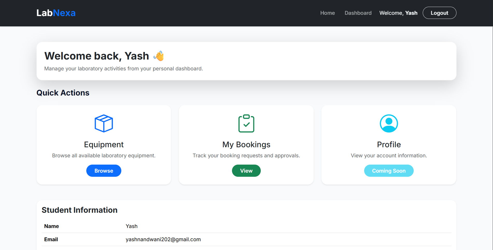
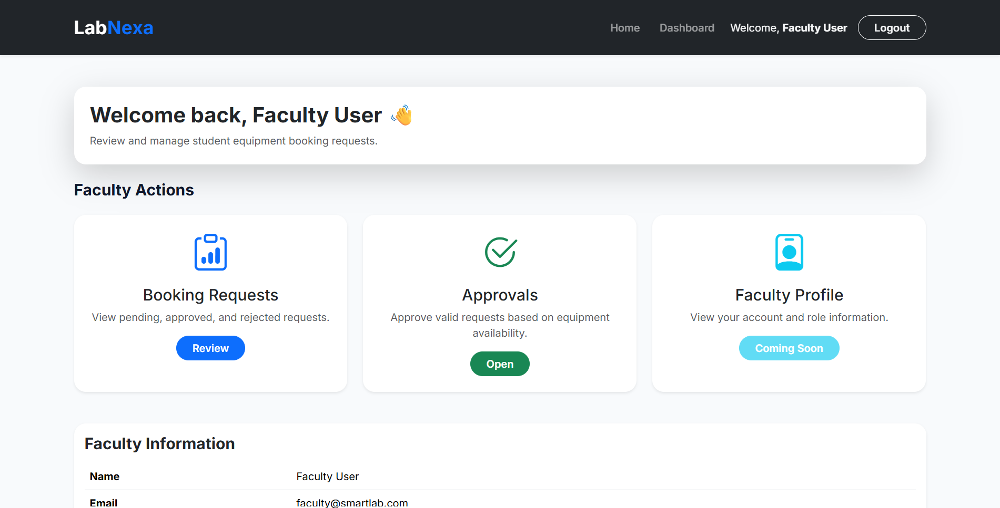
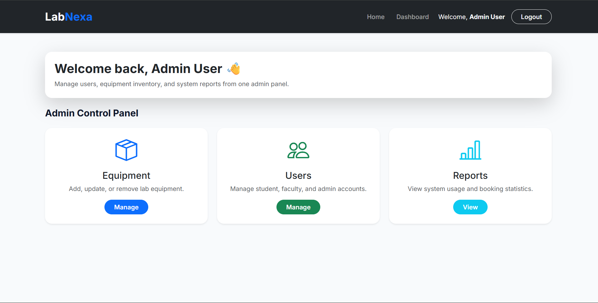
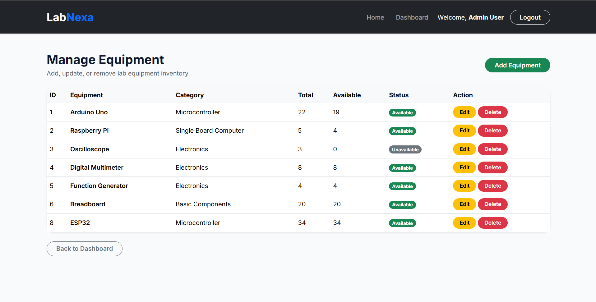
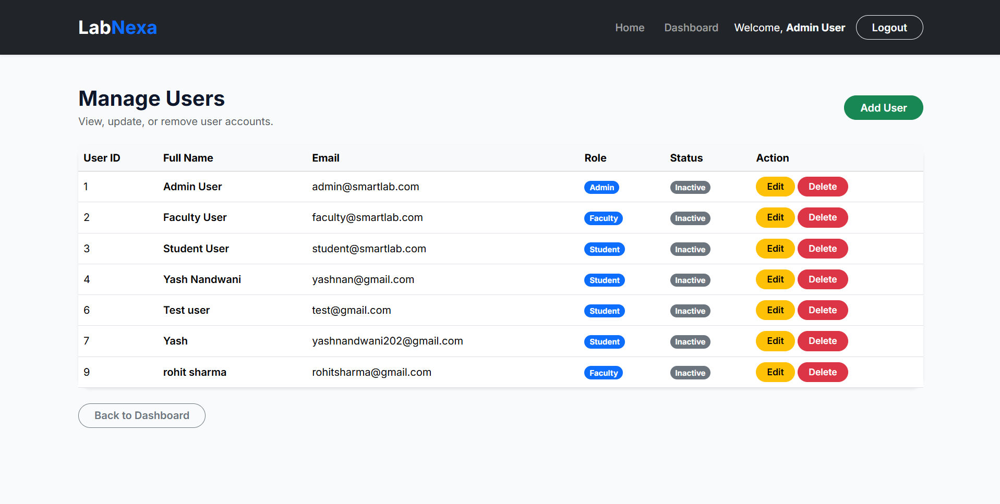
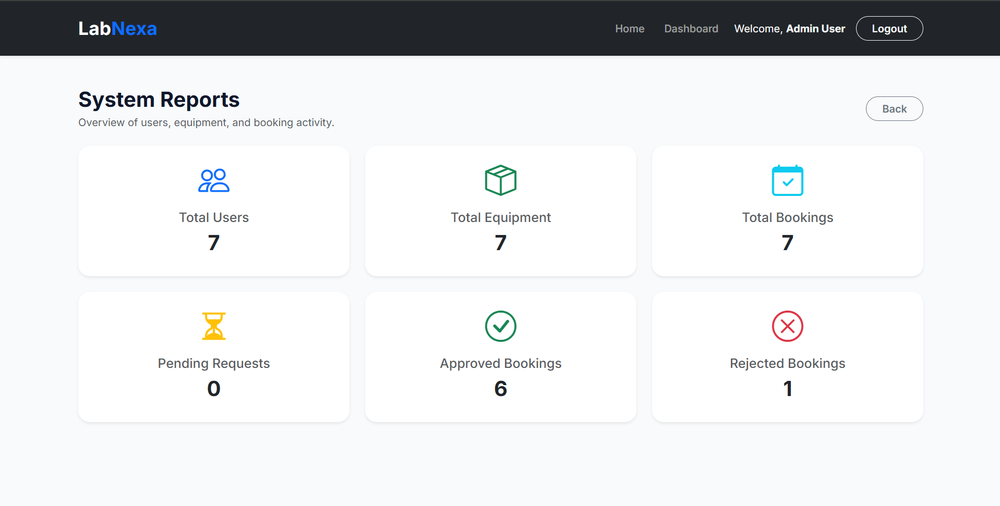

# 🧪 LabNexa

> A modern Laboratory Equipment Management System built with **Flask** and **MySQL** that streamlines equipment booking, approval workflows, inventory management, and user administration.

---

## 📌 Overview

LabNexa is a role-based web application developed to simplify the management of laboratory equipment in educational institutions.

The system allows:

- 👨‍🎓 Students to browse and request laboratory equipment.
- 👨‍🏫 Faculty members to approve or reject booking requests.
- 👨‍💼 Administrators to manage equipment, users, inventory, and system reports.

---

# ✨ Features

### 👨‍🎓 Student Module

- Secure Registration & Login
- Browse Available Equipment
- Book Laboratory Equipment
- View Booking History
- Track Booking Status

---

### 👨‍🏫 Faculty Module

- Secure Login
- View Pending Requests
- Approve Bookings
- Reject Bookings

---

### 👨‍💼 Admin Module

- Dashboard
- Equipment Management (CRUD)
- User Management (CRUD)
- Inventory Management
- System Reports

---

### 🔐 Security

- Password Hashing (Werkzeug)
- Session Authentication
- Role-Based Access Control
- Protected Routes

---

# 🛠️ Technology Stack

| Category | Technology |
|----------|------------|
| Backend | Python, Flask |
| Frontend | HTML5, CSS3, Bootstrap 5 |
| Database | MySQL |
| Template Engine | Jinja2 |
| Version Control | Git & GitHub |

---

# 📂 Project Structure

```text
LabNexa
│
├── static
│   ├── css
│   ├── images
│   ├── js
│   └── screenshots
│
├── templates
│
├── app.py
├── schema.sql
├── requirements.txt
├── .gitignore
└── README.md
```

---

# 📸 Application Screenshots

## 🏠 Homepage


---

## 👨‍🎓 Student Dashboard



---

## 👨‍🏫 Faculty Dashboard



---

## 👨‍💼 Admin Dashboard



---

## 📦 Equipment Management



---

## 👥 User Management



---

## 📊 Reports Dashboard



---

# 👥 User Roles

| Role | Responsibilities |
|------|------------------|
| Student | Register, Login, Book Equipment, View Bookings |
| Faculty | Review, Approve & Reject Requests |
| Administrator | Manage Users, Equipment, Inventory & Reports |

---

# 🚀 Installation

Clone the repository

```bash
git clone https://github.com/yashnandwani202-ops/labnexa.git
```

Go to the project

```bash
cd labnexa
```

Create a virtual environment

```bash
python -m venv venv
```

Activate it

Windows

```bash
venv\Scripts\activate
```

Install dependencies

```bash
pip install -r requirements.txt
```

Import the database

```
schema.sql
```

Run the application

```bash
python app.py
```

Open

```
http://127.0.0.1:5000
```

---

# 🔮 Future Enhancements

- Equipment Search
- QR Code Based Equipment Checkout
- Email Notifications
- Dashboard Analytics
- Equipment Images
- Mobile Responsive Improvements

---

# 👨‍💻 Developer

**Yash Nandwani**

B.Tech Electronics & Computer Engineering (ECM)

GitHub:
https://github.com/yashnandwani202-ops

---

## ⭐ If you found this project useful, consider giving it a star.